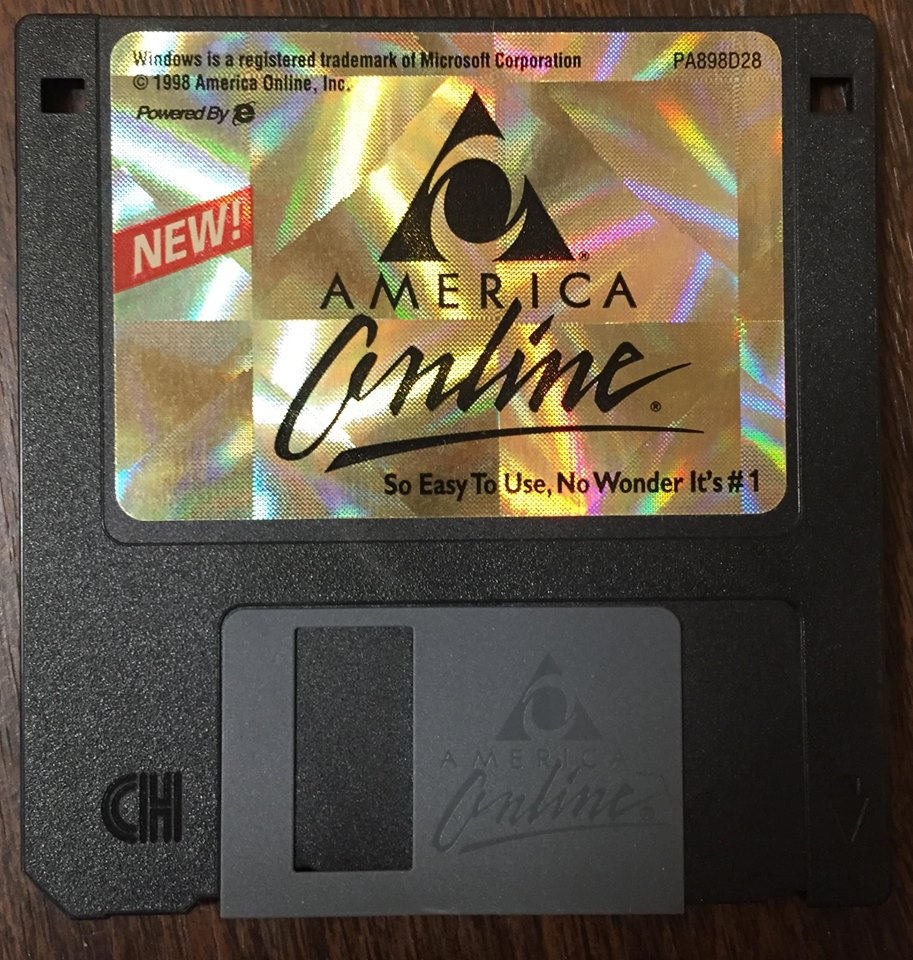
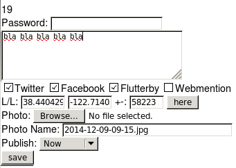
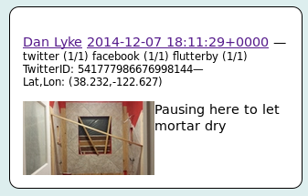
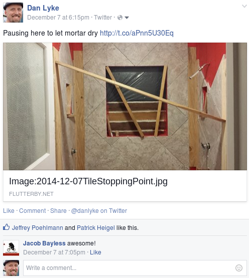

# Introduction to the Indie Web

## returning social media to its roots

---

## Me: Dan Lyke

My (non-techie) sister: "Does it ever bug you that you did everything Facebook does, 6 years earlier?"

- BBS user since early '80s
- and operator (1:362/1203, among others)
- Hyper! HTML browser in 1993, that ran on a BBS platform
- Web presence since mid 1994
- Microportalist/Weblogger/whatever since February 1998.

---

## A Brief History of Weblogs

Not quite escribitionism

- August 1997: Scripting News and Steve Jobs' return to Apple
- Jorn Barger coined "weblog" in December 1997
- my own Newwwsboy, February 1998.
- "Microportals"
- Peter Merholz coined "blog" in April or May of 1999

  I've decided to pronounce the word "weblog" as wee'- blog. Or "blog" for short."

- Dave Winer building a community
- Pyra launches Blogger, August 23 1999

---

## A Brief History of "Social Media"

The Facebook of the '90s:

---

## Silos vs Distributed

- CompuServe
- BBSes (1978), Usenet (1980), and FidoNet (1984)
- AOL, Prodigy, Delphi, WELL, etc)
- The September That Never Ended
- Personal sites, Journalers (Bryon Sutherland, etc)
- Geocities, Tripod, Talk.Salon.com
- Weblogs (including Blogger)
- Twitter, Facebook, MySpace, Facebook, LiveJournal, Tumblr, Orkut, Tribe, Ello, ...

(Google+?)

---

## Silos: Bad Investment

"Yeah, my girlfriend's 15-year-old daughter has to use Facebook because the adults who plan her theater events haven't figured out that <i>none of the kids they're trying to organize use Facebook, not a single one</i>. She logged in on my phone yesterday because she deleted it from hers to save space. (And Safari wouldn't load the website for some reason.)"

http://www.metafilter.com/149084/A-Youth-Untouched-By-Social-Media#6019992

---

## Silos: Unreliable

- Data apocalypse (from your ISP to AOL HomeSites to GeoCities to Posterous to TwitPic to Ancestry.com)

http://www.slate.com/articles/technology/future_tense/2015/04/myfamily_shuttered_ancestry_com_deleted_10_years_of_my_family_history.html

---

## Silos: Evil
- Controlling presentation / Sociology experiments on you.
- NymWars
- Content restrictions
- Searching your history

---

## Distributed: Better

- Keep your data around for posterity
- Read what you want to
- Be who you want to / control what you share
- Say what you want to
- Avoid lock-in

---

## Principles to get there

- Principles over project-centrism: Worry about interop, not specific applications.
- Selfdogfood: Code runs, standards documents don't, scratch your own itch first.
- Design first, formats second: prototype for what you want to have happen, how it happens will evolve.

---

## Mechanics to get there

- Back to blogs?
- POSSE: Publish Own Site, Syndicate Everywhere
- PESOS: Publish Elsewhere, Syndicate Own Site
- Interop between personal sites
- Search / Syndication
- Is the web the right platform?

---

## Back to blogs

- *.blogspot.com/*.wordpress.com just lets someone else own it.
- domain names are hard to justify, and expire
- but at least you own it.

---

## POSSE - writing

A few lines of code back in May of 2009...

---

## POSSE - reading

---

## POSSE - Twitter

---

## POSSE - Facebook

---

## Micropub

http://indiewebcamp.com/micropub 

Micropub is an open API standard that is used to create posts on one's own domain using third-party clients. Web apps and native apps (e.g. iPhone, Android) can use Micropub to post short notes, photos, events or other posts to your own site, similar to a Twitter client posting to Twitter.com. 

---

## POSSE - Micropub to ...

https://feverdream.herokuapp.com/

Feverdream lets you use Micropub clients like Quill to post to hosted blogs on Wordpress.com, Tumblr, or Blogger. 
---

## PESOS

- Sometimes their UI is better
- Cronjobs grabbing archives

---

## PESOS - Micropub

http://ownyourgram.com/

http://github.com/snarfed/ownyourresponses

--

## Interop

- Comments
- Like
- RSVP (yes/no/maybe)
- @mentions
- Discovery
- Other stuff?

---

## Interop - Webmention/Indie-Action

&lt;link rel="webmention" href="http://www.flutterby.com/archives/webmention.cgi" /&gt;

&lt;indie-action do="post" with="http://www.flutterby.com/archives/comments/20715.html"&gt;
&lt;form method="post" accept-charset="UTF-8" style="margin-left: 0;" action="/archives/viewentry.cgi?id=20715"&gt;

---

## Interop - Hacking MIME types

Evolving.

---

## Interop - Microformats2

&lt;article class="h-entry"&gt;&lt;h2 class="p-name"&gt;On longevity and code&lt;/h2&gt;
&lt;div&gt;
&lt;p&gt;&lt;strong&gt;2014-12-08 03:08:15.357549-08 by 
&lt;a href="/archives/user.cgi?id=1" class="p-author h-card"&gt;Dan Lyke&lt;/a&gt; 
 2 comments [&lt;a href="/archives/editentry.cgi?id=20715"&gt;edit&lt;/a&gt;]  &lt;/strong&gt;&lt;/p&gt;
&lt;/div&gt;

&lt;div class="e-content"&gt;&lt;p&gt;&lt;a href="https://twitter.com/dalmaer/status/540614799886139392"&gt;RT Dion Almaer &#8207;@dalmaer&lt;/a&gt;:&lt;/p&gt;

&lt;blockquote&gt;&lt;p&gt;   "compiling a C program from 20+ years ago is actually a lot easier than getting a Rails app from last year to work" &lt;a href="https://passy.svbtle.com/building-vim-from-1993-today"&gt;https://passy.svbtle.com/building-vim-from-1993-today&lt;/a&gt;
&lt;/p&gt;

&lt;/blockquote&gt;&lt;/div&gt;

---

## Interop - Other mechanisms

- OPML files and feeds
- Brid.gy
- WithKnown.com

---

## Interop - Search & Syndication

- A smarter aggregator/feed reader?
- Searching my archives vs searching my feed reader's archives

---

## Interop: Known Demo

---

## Is the web the right platform?

- Domain names
- Distributed hosting
- Reader control
- End-to-end Encryption

---

## Detractors

Clay Shirky's "Bad Idea Bulletin Board" https://ello.co/cshirky/post/fN-7ZRpvarjpZE34HwGkoA

---

## Resources

- http://www.indiewebcamp.com
- Freenode IRC channel indiewebcamp
- http://microformats.org/
- https://www.brid.gy/
- https://withknown.com/

danlyke@flutterby.com
http://www.flutterby.net/User:DanLyke

